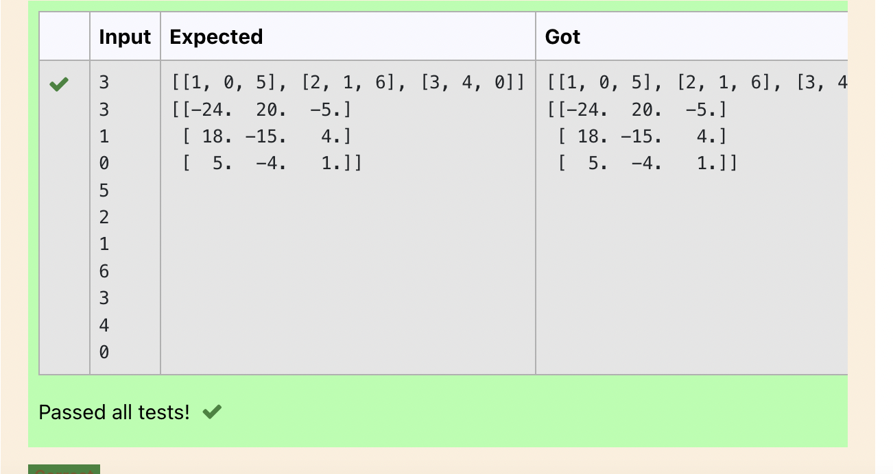

# Inverse-of-matrix

## AIM:

## ALGORITHM:
### Step 1 :
1import numpy module

### Step 2:
Declare a variables l1 and l2 as a empty list
### Step 3:
Get the input of the variables n and m
### Step 4:
Loop a variable i in the range of n and nest loop a variable j in range m

### Step 5:
Get the value of nump variables

### step 6:
During the loop append the nump values to l1 and l1values to list l2

### step 7:
Declare a variable value 1 and l2 by converting to an array
### step 8:
Declare a variable inverse,using numpy module's linalg and inv functions find the inverse of l2

### step 9:
Print the values of inverse

## PROGRAM:
~~~
import numpy as np
l1,l2=[],[]
n1,n2=int(input()),int(input())
for i in range (n1):
    for j in range (n2):
        values=int(input())
        l1.append(values)
    l2.append(l1)
    l1=[]
print(l2)
matrix=np.array(l2)
inverse=np.linalg.inv(matrix)
print(inverse)

~~~

## OUTPUT:

## RESULT:
